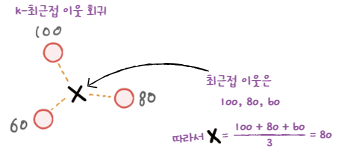
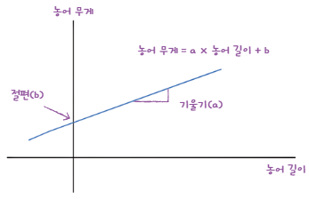
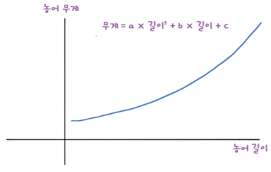
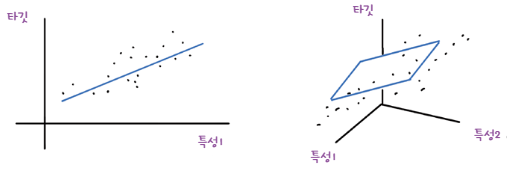
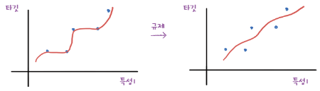
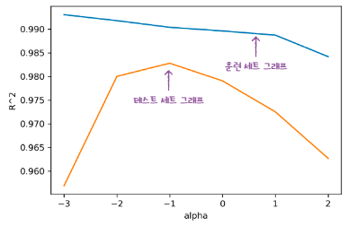
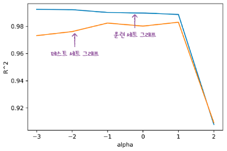

# 1주차 - Chapter 03 회귀 알고리즘과 모델 규제

- [MLDL 스터디 1회차 실습 코드 - 3장 회귀 알고리즘과 모델 규제](https://colab.research.google.com/drive/1KOSxotumVYleObEcGEIcb65wgrT5zNTQ#scrollTo=9krek9GgqIgZ)

## k-최근접 이웃 회귀

**회귀** -> 임의의 어떤 숫자를 예측하는 문제

- 예측하려는 샘플에 가장 가까운 샘플 k개를 선택
- 이웃 샘플의 수치를 사용해 새로운 샘플 X의 타깃을 예측
    - 해당 수치들의 평균을 구함

### 결정계수($R^2$)

> **KNeighborsRegressor:** 사이킷런에서 k-최근접 이웃 회귀 알고리즘을 구현한 클래스

$$R^2 = 1 - \frac{\sum{(\text{타깃} - \text{예측})^2}}{\sum{(\text{타깃} - \text{평균})^2}}$$

- 타깃의 평균 정도를 예측하는 수준이라면 $R^2$는 0에 가까워짐
- 예측이 타깃에 아주 가까워지면 (분자가 0에 가까워지기 때문에) 1에 가까운 값이 됨

> **mean_absolute_error:** 타깃과 예측의 절댓값 오차를 평균하여 반환함

### 과대적합 vs 과소적합

**과대적합:** 훈련 세트에서 점수가 굉장히 좋았는데 테스트 세트에서는 점수가 굉장히 나쁜 경우 
**과소적합:** 훈련 세트보다 테스트 세트의 점수가 높거나 두 점수가 모두 너무 낮은 경우

- 이웃의 개수 k를 줄이면 훈련 세트에 있는 국지적인 패턴에 민감해지고, 이웃의 개수를 늘리면 데이터 전반에 있는 일반적인 패턴을 따를 것임

## 선형 회귀

> 널리 사용되는 대표적인 회귀 알고리즘으로, 특성이 하나인 경우 어떤 직선을 학습하는 알고리즘

- **모델 파라미터:** 머신러닝 알고리즘이 찾은 값(coef_, intercept_)
- **모델 기반 학습:** 머신러닝 알고리즘이 훈련 데이터를 통해 모델 파라미터를 학습하는 방식
- **사례 기반 학습:** 훈련 데이터를 그대로 저장하고, 새로운 데이터가 들어왔을 때 이를 기반으로 예측하는 방식

> **LinearRegression:** 사이킷런의 선형 회귀 클래스

### 다항 회귀

- 다항식을 사용한 선형 회귀

## 특성 공학과 규제

### 다중 회귀

- 여러 개의 특성을 사용한 선형 회귀

- **특성 공학:** 기존의 특성을 사용해 새로운 특성을 뽑아내는 작업

### 사이킷런의 변환기

- **변환기:** 특성을 만들거나 전처리하는 클래스

> **PolynomialFeatures:** 주어진 특성을 조합하여 새로운 특성을 만듬

### 규제

- 머신러닝 모델이 훈련 세트를 너무 과도하게 학습하지 못하도록 훼방하는 것
- 선형 회귀 모델의 경우 특성에 곱해지는 계수(또는 기울기)의 크기를 작게 만드는 일

---
**릿지 회귀:** 계수를 제곱한 값을 기준으로 규제를 적용

**라쏘 회귀:** 계수의 절댓값을 기준으로 규제를 적용 
-> 최적의 모델을 찾기 위해 좌표축을 따라 최적화를 수행해가는 좌표 하강법을 사용

> **릿지 회귀**는 모든 특성을 활용하며 과적합을 줄이는 데 효과적, **라쏘 회귀**는 불필요한 특성을 제거하면서 모델을 간결하게 만듬 
**데이터에 불필요한 특성이 많을 때**는 라쏘, **모든 특성을 유지하고 싶다**면 릿지를 선택하는 것이 좋음

---
**하이퍼파라미터:** 머신러닝 모델이 학습할 수 없고 사람이 알려줘야 하는 파라미터(alpha 값)

- alpha 값이 크면 규제 강도가 세지므로 계수 값을 더 줄이고 조금 더 과소적합되도록 유도
- alpha 값이 작으면 계수를 줄이는 역할이 줄어들고 선형 회귀 모델과 유사해지므로 과대적합될 가능성이 큼
- alpha 값에 대한 $R^2$ 값의 그래프를 그려 보며, 훈련 세트와 테스트 세트의 점수가 가장 가까운 지점이 최적의 alpha 값이 됨
