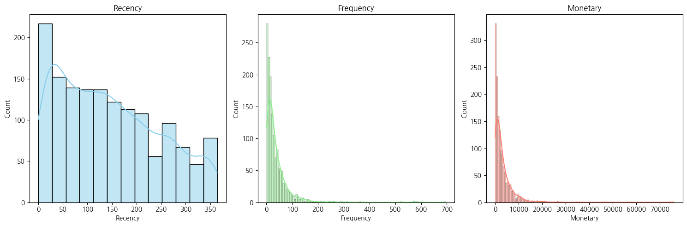
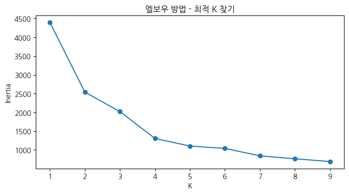
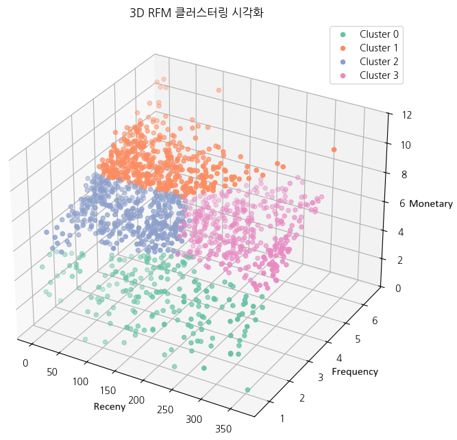

# 2주차 - Chapter 04 다양한 분류 알고리즘 & Chapter 06 군집 알고리즘/k-평균

- [MLDL 스터디 2회차 실습 코드](https://colab.research.google.com/drive/1csiEgAD0ZIxalVCP2KLDqr1LfumSvk0t)

## 관련 추가 내용 정리

### 주요 매개변수 설명

**`LogisticRegression`**

- `solver`: 최적화 알고리즘 선택
  - `'liblinear'`: 
    - 소규모 데이터셋에 적합
    - L1 및 L2 규제 모두 지원
    - 이진 분류에서 주로 사용
  - `'lbfgs'` (기본값): 
    - 다중 클래스 분류에 적합
    - L2 규제 전용
  - `'saga'`: 
    - 대규모 데이터셋, 희소 행렬 처리에 적합
    - L1, L2, ElasticNet 모두 지원
    - 확률적 경사 하강법(SGD)을 사용

- `penalty`: 정규화(규제) 유형 설정
  - `'l2'`: 
    - 일반적으로 많이 사용되는 Ridge 정규화
    - 가중치의 크기를 작게 만들어 과적합 방지
  - `'l1'`: 
    - Lasso 정규화로 불림
    - 불필요한 특성을 0으로 만들어 특성 선택 기능 수행
  - `'elasticnet'`: 
    - L1 + L2 혼합형 규제
    - `solver='saga'`일 때만 사용 가능

- `C`: 규제 강도 조절
  - **규제 역수**  
  - 값이 **작을수록 규제가 강해지고, 클수록 규제가 약해짐**

---
**`SGDClassifier`**  

- `loss`: 손실 함수 지정  
  - `'hinge'`: SVM(서포트 벡터 머신) 손실 함수  
  - `'log_loss'`: 로지스틱 회귀 (이진 분류용)  
  - `'modified_huber'`: 이상치에 강건한 허브 손실 함수

- `penalty`: 정규화(규제) 방식  
  - `'l2'`: Ridge 정규화  
  - `'l1'`: Lasso 정규화  
  - `'elasticnet'`: L1 + L2 혼합 정규화

- `alpha`: 규제 강도 (작을수록 약한 규제, `LogisticRegression`의 `C`와 반비례 관계)  
- `max_iter`: 최대 반복 횟수 (기본값: 1000)  
- `tol`: 수렴 허용 오차 (작을수록 정밀, 너무 작으면 수렴 안 될 수 있음)  
- `n_iter_no_change`: `tol` 기준 성능 개선이 없을 경우 반복 중단까지의 횟수

---
**`SGDRegressor`**  

- `loss`: 손실 함수 지정  
  - `'squared_error'`: 평균 제곱 오차 (기본값)  
  - `'huber'`: 이상치에 강건한 손실 함수  
  - `'epsilon_insensitive'`: ε-무감각 손실 함수 (SVR과 유사)

- `penalty`: 정규화 방식  
  - `'l2'`: Ridge  
  - `'l1'`: Lasso  
  - `'elasticnet'`: L1 + L2 혼합

- `alpha`: 규제 강도  
- `max_iter`: 최대 반복 횟수  
- `tol`: 수렴 허용 오차  
- `n_iter_no_change`: 반복 중단 기준

---
**`KMeans`**  

- `n_clusters`: 클러스터(군집) 개수 지정  
- `n_init`: 서로 다른 초기 중심 설정 횟수  
  - 기본값은 `'auto'` (과거에는 `10`)  
  - 여러 번 초기화를 시도하고 최적의 결과를 선택

- `max_iter`: 중심 재조정 반복 최대 횟수 (기본값: 300)


## 관련 추가 개인 실습 - 토이 프로젝트

**RFM 분석**<br>
마케팅, CRM(Customer Relationship Management, 고객 관계 관리) 등에서 자주 활용되는 고객 가치 평가 기법

| 항목           | 의미     | 설명                                           |
|----------------|----------|------------------------------------------------|
| **R - Recency**    | 최근성   | 고객이 얼마나 최근에 구매했는가? (최근일수록 점수 높음) |
| **F - Frequency**  | 빈도     | 고객이 얼마나 자주 구매했는가? (많을수록 점수 높음)     |
| **M - Monetary**   | 금액     | 고객이 얼마나 많은 돈을 썼는가? (클수록 점수 높음)     |

```PYTHON
# 원본 데이터셋 복사
rfm_test = test.copy()

# Recency 계산
last_date = rfm_test['거래날짜'].max()
recency_df = rfm_test.groupby('고객ID')['거래날짜'].max().reset_index()
recency_df['Recency'] = (last_date - recency_df['거래날짜']).dt.days

# Frequency 계산
frequency_data = rfm_test.groupby('고객ID')['거래ID'].count().reset_index()
frequency_data.rename(columns={'거래ID': 'Frequency'}, inplace=True)

# Monetary 계산
rfm_test['SalesValue'] = rfm_test['수량'] * rfm_test['평균금액']
monetary_data = rfm_test.groupby('고객ID')['SalesValue'].sum().reset_index()
monetary_data.rename(columns={'SalesValue': 'Monetary'}, inplace=True)

# RFM 데이터 결합
rfm_df = recency_df.merge(frequency_data, on='고객ID').merge(monetary_data, on='고객ID')
```



---
```PYTHON
# RFM 스케일링
rfm_scaled = rfm_df[['Recency', 'Frequency', 'Monetary']].copy()
scaler = StandardScaler()
rfm_scaled = scaler.fit_transform(rfm_scaled)

# 최적의 K 찾기 (엘보우 방법)
inertia = []
K_range = range(1, 10)
for k in K_range:
    kmeans = KMeans(n_clusters=k, random_state=42)
    kmeans.fit(rfm_scaled)
    inertia.append(kmeans.inertia_)

plt.figure(figsize=(8, 4))
plt.plot(K_range, inertia, marker='o')
plt.xlabel('K')
plt.ylabel('Inertia')
plt.title('엘보우 방법 - 최적 K 찾기')
plt.show()
```



---
```PYTHON
# 최적 K 선택
optimal_k = 4
kmeans = KMeans(n_clusters=optimal_k, random_state=42)
rfm_df['Cluster'] = kmeans.fit_predict(rfm_scaled)

# 클러스터별 평균 RFM 확인
cluster_summary = rfm_df.groupby('Cluster')[['Recency', 'Frequency', 'Monetary']].mean().round(1)
display(cluster_summary)
```

| Cluster | Recency | Frequency | Monetary |
|---------|---------|-----------|----------|
|   0     | 193.5   |   1.3     |   4.3    |
|   1     | 78.4    |   4.2     |   8.6    |
|   2     | 82.8    |   2.7     |   7.0    |
|   3     | 265.7   |   3.1     |   7.4    |

---
```PYTHON
fig = plt.figure(figsize=(12, 8))
ax = fig.add_subplot(111, projection='3d')

colors = sns.color_palette('Set2', rfm_df['Cluster'].nunique())
for i, cluster in enumerate(sorted(rfm_df['Cluster'].unique())):
    subset = rfm_df[rfm_df['Cluster'] == cluster]
    ax.scatter(subset['Recency'], subset['Frequency'], subset['Monetary'], 
               label=f'Cluster {cluster}', color=colors[i])

plt.title('3D RFM 클러스터링 시각화')
ax.legend()
plt.show()
```



---
**k-평균 알고리즘을 통한 고객 군집화**

| 클러스터 | 고객 유형           | 설명                                                                 |
|----------|--------------------|----------------------------------------------------------------------|
| 1        | **핵심 파트너 고객** | `Recency` 낮고, `Frequency`와 `Monetary` 매우 높음 → 최근 자주 많이 구매하는 우수 고객 |
| 2        | **성장형 고객**     | `Recency` 낮고, `Frequency`와 `Monetary` 중상 → 자주는 아니지만 가치 있는 소비 고객 |
| 3        | **유망 고객**       | `Recency` 높고, `Frequency`와 `Monetary` 높음 → 활동은 줄었지만 재활성화가 유효한 고객 |
| 0        | **이탈 위험 고객**   | `Recency` 높고, `Frequency`와 `Monetary` 낮음 → 마지막 구매가 오래됐고 활동성 낮은 고객 |