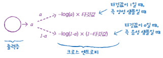

# 4주차 - Chapter 06 주성분 분석 & Chapter 07 딥러닝을 시작합니다

- [MLDL 스터디 4회차 실습 코드](https://colab.research.google.com/drive/1cBWIdRLw2w1D_0ovPUEH_b-ikL-5rxfU)

## 관련 추가 내용 정리

### 딥러닝에서는 일반적으로 **교차 검증** 대신 **훈련/검증 데이터 분리 방식**을 더 많이 사용함

> **데이터가 충분히 크기 때문에** 
→ 딥러닝에서 사용하는 데이터셋은 대체로 크기가 커서, 검증 점수가 안정적으로 나옴
>
> **교차 검증은 연산 비용이 너무 큼** 
→ 딥러닝 모델은 훈련하는 데 시간이 오래 걸리기 때문에, 교차 검증처럼 여러 번 학습하는 방식은 시간과 자원이 매우 많이 소모됨

---
### **이진 분류:** loss = 'binary_crossentropy'

- **출력 뉴런 수:** 1개  
- **출력값 $a$:** 시그모이드 함수 결과 → 양성 클래스일 확률  
- **손실 계산 방식:**
  - 타깃이 1인 경우: `−log(a)`
  - 타깃이 0인 경우: `−log(1−a)`

### **다중 분류:** loss = 'categorical_crossentropy'

- **출력 뉴런 수:** 클래스 개수만큼 존재  
- **출력값:** 소프트맥스 함수 결과 → 각 클래스별 확률 벡터  
- **정답 라벨:** 원-핫 인코딩된 벡터 (예: `[0, 1, 0, 0, ...]`)  
- **손실 계산 방식:**  
  정답 위치의 확률값에 대해 `−log(정답 클래스 확률)` 계산  
  (나머지 클래스는 원-핫 벡터에서 0이므로 무시됨)

### **그런데 왜 `sparse`?**

- 정답 라벨을 **벡터**가 아닌 **정수 인덱스**로 표현할 수 있음 (예: 0, 1, 2)
- 이 경우 손실 함수로 **`sparse_categorical_crossentropy`** 사용  
  → 자동으로 해당 인덱스 위치만 사용하여 손실 계산 (원-핫 인코딩 불필요)

---
### **사이킷런 vs 케라스 클래스 사용법 차이**

| 항목       | 사이킷런                            | 케라스                                           |
|------------|-------------------------------------|--------------------------------------------------|
| 손실 함수  | `'log_loss'` (로지스틱 손실)       | `'sparse_categorical_crossentropy'`             |
| 반복 횟수  | `max_iter` 매개변수로 지정         | `epochs` 매개변수로 지정                        |
| 출력 설정  | 자동 처리                          | 출력 뉴런 수 직접 지정 (`Dense(10)`)            |
| 평가 방법  | `.score()` 함수 사용                | `.evaluate()` 함수 사용                         |

---
### **왜 은닉층에 활성화 함수를 사용해야 할까?**

신경망의 은닉층에 **활성화 함수**를 사용하는 이유는 단순히 숫자 계산만 하는 선형 연산으로는 복잡한 문제를 해결할 수 없기 때문임

- 은닉층이 있어도 **결과적으로는 하나의 선형 방정식**으로 표현됨 
→ 즉, **은닉층의 존재 의미가 사라짐**

- 중간에 비선형 함수 `log()`가 포함되면 전체 네트워크를 단순한 선형식으로 표현할 수 없음 
→ **복잡한 함수 학습 가능**, **모델의 표현력 증가**

---
### **렐루 함수가 효과적인 이유는?**

| 구분             | 설명                                                                 |
|------------------|----------------------------------------------------------------------|
| 계산 간편성      | 수식이 `ReLU(z) = max(0, z)` 형태로 매우 단순해 계산 비용이 적음               |
| 기울기 소실 완화 | 시그모이드와 달리 양수 영역의 기울기가 1로 일정하여, 역전파 시 그레이디언트가 잘 전달됨 |
| 희소성 유도      | 음수 입력은 0이 되어 일부 뉴런이 비활성화됨 → 모델의 일반화 성능에 기여           |
| 비선형성 유지    | 선형처럼 보이지만 0을 기준으로 비선형 함수이므로 딥러닝 모델 구성에 적합함          |

---
### **`EarlyStopping` vs `ModelCheckpoint` 비교**

| 항목                  | `EarlyStopping` 콜백                                         | `ModelCheckpoint` 콜백                                      |
|-----------------------|--------------------------------------------------------------|-------------------------------------------------------------|
| **목적**              | 과적합 방지를 위해 학습 조기 종료                            | 성능이 가장 좋은 모델을 저장                                |
| **기준 지표**         | 검증 손실(val_loss) 또는 정확도(val_accuracy) 등            | 지정한 모니터 지표 (기본은 val_loss)                        |
| **주요 기능**         | 성능 향상이 없으면 학습 멈춤                                 | 특정 조건 만족 시마다 모델을 저장                           |
| **파라미터 예시**     | `monitor='val_loss', patience=5`                             | `monitor='val_accuracy', save_best_only=True`              |
| **모델 저장 여부**    | 저장 기능 없음 (단지 학습 중단)                              | 자동으로 모델 파일(.h5 등) 저장                             |
| **사용 예시**         | `EarlyStopping(monitor='val_loss', patience=5)`              | `ModelCheckpoint(filepath='best.h5', save_best_only=True)` |
| **활용 목적**         | **무의미한 학습 반복 방지**                                 | **최적 모델을 저장하고 이후 불러오기 용이하게**            |

=> EarlyStopping 콜백을 ModelCheckpoint 콜백과 함께 사용하면 가장 낮은 검증 손실의 모델을 파일에 저장하고 검증 손실이 다시 상승할 때 훈련을 중지할 수 있고, 훈련을 중지한 다음 현재 모델의 파라미터를 최상의 파라미터로 되돌림